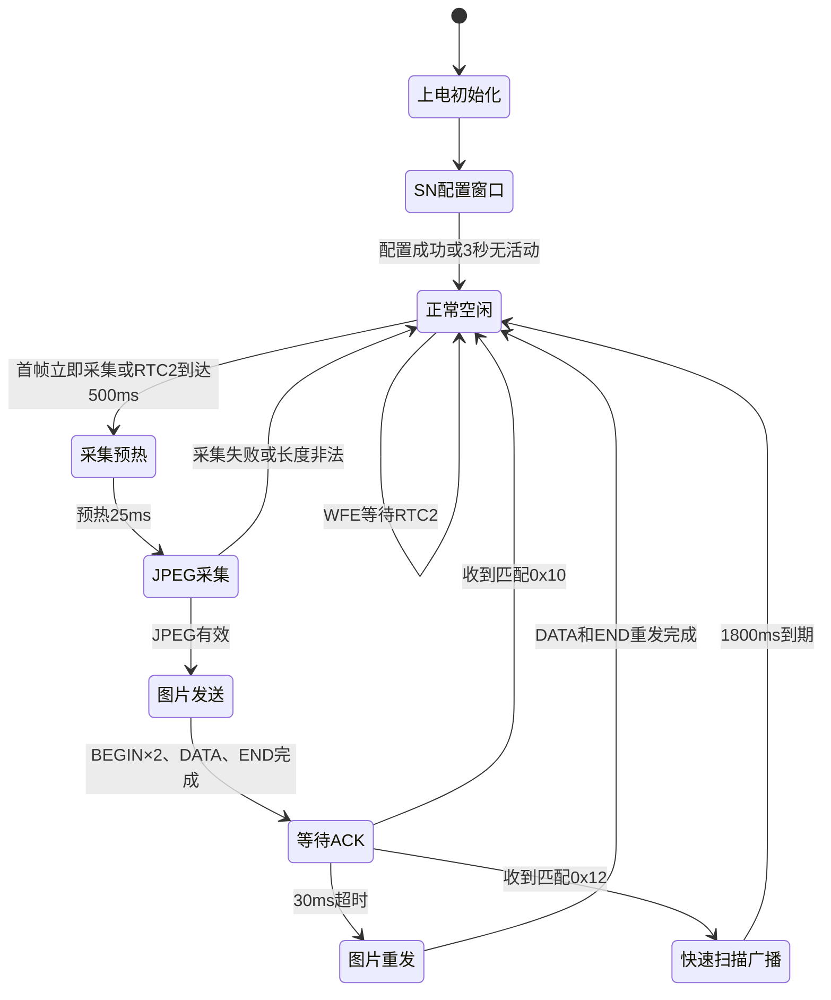

# TX 软件框架与完整运行流程

本文说明当前 `nrf_tx/examples/peripheral/radio/TX` 工程的整体行为，重点描述上电、SN配置、周期唤醒、图像采集、无线发送、ACK重发、天线扫描协商和低功耗之间的关系。协议字段的逐字节定义见 `01-通信协议.md`。

## 1. TX职责

TX运行在nRF52832上，主要完成：

1. 从Flash加载胶囊SN；没有有效用户SN时使用FICR DEVICEID。
2. 上电时开放一次出厂SN配置窗口。
3. 控制OV7676、CX93510、补光灯和ADXL362完成一帧采集。
4. 把JPEG拆成固定254字节Radio包发送给RX。
5. 在END后短暂接收图片ACK或快速扫描请求。
6. 空闲时关闭高频时钟和不需要的外设，由RTC2周期唤醒。

TX不选择12路接收天线。天线选择由RX完成；TX只在收到合法扫描请求后暂停图片并临时密集广播SN。

## 2. 关键参数

| 参数 | 当前值 | 实际作用 |
| --- | ---: | --- |
| Radio中心频率 | 2400 MHz | nRF `FREQUENCY=0` |
| Radio速率 | 2 Mbit/s | TX和RX必须一致 |
| Radio发射功率 | +4 dBm | `TXPOWER=Pos4dBm` |
| Radio固定包长 | 254字节 | BEGIN、DATA、END、ACK及扫描包均固定长度 |
| Radio硬件CRC | CRC16 | 初值`0xFFFF`，多项式`0x11021` |
| 图片周期 | 500 ms | RTC2设置下一次采集请求 |
| 普通SN周期 | 当前随图片周期为500 ms | RTC2使用`IMAGE_PERIOD_MS`同时设置SN广播请求；`SN_BROADCAST_PERIOD_MS`目前只用于启动日志 |
| 摄像头/补光预热 | 25 ms | 等待补光、AE/AWB和加速度样本稳定 |
| 单次采集超时 | 1000 ms | `cx93510_capture_one()`最长等待时间 |
| TX原始JPEG上限 | 19252字节 | 超过后不进入无线发送 |
| DATA协议头 | 12字节 | CMD、Frame ID、SN和分片号 |
| 每个DATA有效载荷 | 242字节 | `254-12` |
| DATA分片间隔 | 1 ms | 由活动阶段TIMER1时间基准控制 |
| BEGIN重复次数 | 2次 | 每帧首次发送时连续发送 |
| DATA发送遍数 | 1遍 | `IMAGE_REPEAT_SEND_ENABLED=0` |
| ACK窗口 | 30 ms | 首轮END发送后开启RX |
| ACK超时重发 | 最多1次 | 重发全部DATA和END，不重发BEGIN |
| 快速扫描窗口 | 1800 ms | TX暂停图片并密集广播SN |
| 快速SN间隔 | 8 ms | 供RX逐天线采集RSSI |
| SN配置无活动超时 | 3000 ms | 每条合法配置命令都会刷新计时 |
| 配置状态灯翻转 | 100 ms | 上电配置窗口内快速闪烁 |
| 启动SN广播 | 3次 | 配置窗口结束后广播当前有效SN |
| 看门狗 | 3 s | WFE休眠期间仍运行，调试暂停时停止 |

### 2.1 总状态图



## 3. 两套时间资源

### 3.1 TIMER1：活动阶段1 ms时间基准

TIMER1配置为1 ms中断，`TIMER1_IRQHandler()`每次执行：

```c
++g_time_ms;
```

`g_time_ms`用于：

- 上电SN配置窗口超时；
- 25 ms摄像头预热；
- 1 ms图片分片节拍；
- 30 ms ACK超时；
- 1800 ms快速扫描窗口；
- 8 ms快速SN广播间隔。

TIMER1依赖高频时钟，只在有业务时运行。业务全部结束后，TX停止TIMER1并释放外部高频晶振。

### 3.2 RTC2：低功耗500 ms周期唤醒

RTC2使用32.768 kHz内部RC低频时钟，预分频为0。当前500 ms比较值为：

```text
32768 × 500 / 1000 = 16384 ticks
```

每次RTC2比较中断只设置两个请求标志：

```c
m_sn_broadcast_due = true;
g_capture_due = true;
```

中断中不操作摄像头，也不发送Radio包。主循环被唤醒后再处理这些请求。RTC2只负责周期调度，不保存年月日时间；系统日历时间由STM板上的SD2058提供。

当前普通SN和图片共用同一个RTC2比较事件，所以二者实际周期都由 `IMAGE_PERIOD_MS`决定。`SN_BROADCAST_PERIOD_MS`当前仅用于启动日志显示；若以后需要两个不同周期，必须增加独立比较通道或软件分频，不能只修改该宏。

## 4. 上电启动流程

```text
启动32 MHz外部高频晶振
  ↓
初始化日志（总开关关闭时为空操作）
  ↓
从Flash加载SN；无有效记录时使用FICR DEVICEID
  ↓
启动3秒硬件看门狗
  ↓
初始化补光灯/配置状态灯
  ↓
初始化CX93510和OV7676，随后让OV7676休眠
  ↓
关闭空闲的nRF侧SPIM0
  ↓
初始化ADXL362，空闲时保持standby
  ↓
配置2400 MHz、2 Mbit/s、254字节Radio
  ↓
启动TIMER1的1 ms活动时间基准
  ↓
进入上电SN配置窗口
```

### 4.1 上电SN配置窗口

配置窗口只在上电阶段开放。TX持续接收 `0x40～0x46` ZAYS控制命令：

| 命令 | 处理 |
| --- | --- |
| `0x40` | 开始新配置并清除尚未确认的暂存SN |
| `0x42` | 返回本机8字节DEVICEID |
| `0x44` | 校验DEVICEID，匹配后把新SN暂存在RAM |
| `0x46` | 把暂存SN写入Flash、回读生效并返回`0x47` |

窗口在以下任一条件成立时结束：

- `0x46`确认写入成功；
- 连续3000 ms没有收到合法配置命令。

配置期间状态灯每100 ms翻转一次，主循环持续处理Radio、日志、看门狗和WFE等待。窗口关闭后，未确认的暂存SN会被丢弃。

### 4.2 进入正式运行

配置窗口结束后：

1. 关闭持续Radio RX。
2. 连续广播3次当前有效SN。
3. 初始化并启动RTC2。
4. 设置 `g_capture_due=true`，因此第一张图片立即采集，不需要先等待500 ms。
5. 进入永久业务主循环。

## 5. 正常主循环顺序

每轮主循环严格按照以下顺序执行：

```text
有任务且活动时钟已关闭 → 恢复HFXO和TIMER1
  ↓
处理Radio接收队列中的控制包、ACK或扫描请求
  ↓
检查ACK是否达到30 ms超时
  ↓
推进1800 ms快速扫描广播
  ↓
发送到期的普通SN广播
  ↓
推进图像采集状态
  ↓
发送最多一个DATA分片
  ↓
处理日志并喂看门狗
  ↓
无业务时停止TIMER1和HFXO
  ↓
WFE等待RTC2或Radio等中断唤醒
```

先处理Radio再检查ACK超时，可以让截止时间附近刚收到的ACK先被确认，避免不必要的重发。快速扫描服务位于图片采集之前，RX请求扫描后会优先暂停新图片。

## 6. 活动时钟保持条件

以下任一条件成立，TX就保持HFXO和TIMER1运行：

| 条件 | 含义 |
| --- | --- |
| `m_fast_scan_active` | 正在按RX请求密集广播SN |
| `m_sn_broadcast_due` | RTC2已产生普通SN广播请求 |
| `g_capture_due` | RTC2已产生图片采集请求 |
| `m_capture_prep_state != IDLE` | 摄像头、补光灯和加速度计正在预热 |
| `g_image_tx.active` | 当前图片仍有BEGIN、DATA或END需要发送 |
| `g_image_tx.awaiting_ack` | 首轮END已发送，正在等待ACK或扫描请求 |

这些条件全部为假时，TX停止活动时钟并执行 `__WFE()`。RTC2继续运行并负责下一次500 ms唤醒。

## 7. 一帧图片的采集流程

### 7.1 收到采集请求

RTC2每500 ms设置 `g_capture_due=true`。主循环处理时先清除该标志。如果上一帧仍在发送或等待ACK，本次请求直接跳过，不排队，避免覆盖CX93510帧缓冲。

快速扫描期间也会清除采集请求并返回，扫描中不会拍照。

### 7.2 启动预热

可以采集时，TX执行：

1. 恢复访问CX93510所需的nRF SPIM0。
2. 打开P0.08补光灯。
3. 启动ADXL362的100 Hz测量。
4. 唤醒OV7676连续视频输出。
5. 设置当前时间加25 ms为预热截止时间。
6. 将采集状态设为 `CAPTURE_PREP_WARMUP` 并立即返回主循环。

25 ms等待本身不阻塞，期间仍可处理Radio、日志和看门狗。

### 7.3 预热完成并采集

达到截止时间后：

1. 读取一次ADXL362的X/Y/Z原始值并立即让ADXL362待机。
2. 调用 `cx93510_capture_one()`采集JPEG，最长等待1000 ms。
3. JPEG进入CX93510帧RAM后立即关闭补光灯并让OV7676休眠。
4. 保持SPIM0可用，因为后续发送还要从CX93510帧RAM读取JPEG。

“非阻塞采集状态机”指25 ms预热采用分阶段处理；真正的 `cx93510_capture_one()`仍是同步等待，最长可能阻塞1000 ms。

### 7.4 图片有效性检查

以下情况放弃本帧，不分配Frame ID，也不发送BEGIN：

- 采集失败；
- JPEG长度为0；
- JPEG长度超过19252字节。

合法图片的Frame ID按0～254循环。随后清零校验和和重发计数，计算DATA总片数，并设置图片发送状态为活动。

## 8. 图片无线发送流程

### 8.1 分包规则

```text
DATA分片数 = (JPEG长度 + 241) / 242
```

每次主循环调用发送服务时，最多推进一个DATA分片。首个DATA发送前会额外连续发送2个BEGIN，因此第一轮实际为：

```text
BEGIN → BEGIN → DATA[0]
```

后续每轮最多发送一个DATA。相邻DATA的允许发送时间间隔为1 ms。

### 8.2 BEGIN（0x01）

BEGIN携带：

- Frame ID；
- 8字节胶囊SN；
- JPEG总长度；
- DATA总片数；
- TX版本；
- 本帧加速度有效位及X/Y/Z原始值。

BEGIN连续发送2次，不逐包等待确认。完整字节布局见 `01-通信协议.md`。

### 8.3 DATA（0x80）

每个DATA包含12字节协议头和最多242字节JPEG。分片号从0开始，最后一片只包含剩余有效字节，固定254字节包的尾部补0。

TX从 `frame.jpeg_offset + block_sent` 读取CX93510帧RAM，并只把本片有效JPEG字节加入8位累加校验和。读取失败时立即终止该帧、关闭SPIM0且不发送END。

当前 `IMAGE_REPEAT_SEND_ENABLED=0`，所以全部DATA只发一遍。代码保留两遍发送分支，但启用前需要同步复核整图校验和处理和RX行为。

### 8.4 END（0x03）

全部DATA完成后发送END，内容包括Frame ID、SN和整张JPEG有效字节的8位累加和。

首轮END发送完成后，TX立即切换到Radio RX，并设置：

```text
awaiting_ack = true
ACK截止时间 = 当前时间 + 30 ms
```

## 9. ACK和重发

RX返回的普通ACK为 `0x10 + Frame ID + SN`。TX只有在以下条件全部满足时才接受：

1. 当前确实正在等待ACK；
2. Frame ID与当前图片一致；
3. 8字节SN与当前胶囊一致。

匹配成功后，TX关闭Radio RX、清除重发计数并关闭CX93510主机SPI，本帧结束。

30 ms内未收到匹配ACK时：

1. 关闭Radio RX。
2. 重发计数加1。
3. 分片号、已发送字节数和图片校验和清零。
4. 重发全部DATA和END，不重发BEGIN。
5. 当前最多重发1次。
6. 重发END后不再等待第二次ACK，直接关闭SPIM0并结束本帧。

因此当前最坏发送序列是：

```text
BEGIN × 2 → DATA[0...N-1] → END → 等待30 ms
→ DATA[0...N-1] → END → 结束
```

## 10. 快速天线扫描协商

TX只在首轮END后的30 ms接收窗口内接受RX的 `0x12`。请求必须同时匹配当前Frame ID和SN。合法 `0x12`同时结束当前图片ACK等待，不需要RX再发送 `0x10`。

接受请求后：

1. 进入1800 ms快速扫描状态。
2. 清除图片采集请求，扫描期间不拍照。
3. 每8 ms发送 `0x05 + 当前8字节SN`。
4. 前120 ms内，每4次SN广播前插入一次 `0x11 + 当前SN`，帮助RX确认扫描已开始。
5. 1800 ms到期后退出扫描，清除扫描期间积累的普通SN和图片请求。
6. 等待下一个RTC2周期恢复正常500 ms图片流程。

快速扫描和RX十二路驻留、RSSI统计、候选切换的完整说明见 `05-TX-RX天线信号强度配置.md`。

## 11. 低功耗状态

| 部件 | 拍摄/发送阶段 | 空闲阶段 |
| --- | --- | --- |
| CPU | 主循环推进状态机 | `__WFE()`等待事件 |
| HFXO | Radio和活动时序需要时运行 | 无业务时停止 |
| TIMER1 | 1 ms活动时间基准 | 无业务时停止 |
| RTC2 | 始终运行 | 始终运行，500 ms唤醒 |
| OV7676 | 预热和采集时唤醒 | 软件休眠 |
| 补光灯 | 预热和采集时点亮 | 关闭 |
| ADXL362 | 每帧开始临时100 Hz测量 | standby，SPIM1关闭 |
| CX93510 SPIM0 | 采集、读取JPEG、等待可能重发时保持 | ACK完成、重发结束或失败后关闭 |
| Radio RX | 配置窗口或首轮END后最多30 ms | 其余时间关闭 |

## 12. 关键失败处理

| 情况 | TX行为 |
| --- | --- |
| OV7676唤醒失败 | 关闭灯、加速度和SPI，放弃本周期 |
| JPEG采集失败或超时 | 关闭SPIM0，等待下一周期 |
| JPEG为空或超过19252字节 | 不发送任何图片包 |
| CX93510帧RAM读取失败 | 中止发送，不发END |
| ACK超时 | 完整重发一次DATA和END |
| 快速扫描请求ID或SN不匹配 | 忽略，不改变当前ACK状态 |
| 看门狗3秒未喂 | TX复位 |

## 13. 关键源文件

| 文件 | 作用 |
| --- | --- |
| `main.c` | 初始化、SN配置窗口、主循环、TIMER1和低功耗入口 |
| `image.c/.h` | Radio、采集状态、图片发送、ACK和快速扫描 |
| `config.h` | 周期、超时、Radio和功能开关 |
| `legacy_protocol.h` | 无线命令、包长、字段偏移和字节序 |
| `cx93510.c/.h` | JPEG采集和帧RAM读取 |
| `ov7676.c/.h` | 图像传感器初始化、唤醒和休眠 |
| `dev_adxl362.c/.h` | 三轴加速度初始化、测量、读取和待机 |
| `spi_bus.c/.h` | CX93510 SPI总线控制 |
| `capsule_sn_storage.c/.h` | SN Flash持久化和回读校验 |
| `tx_runtime_log.c/.h` | 可裁剪的运行日志 |
