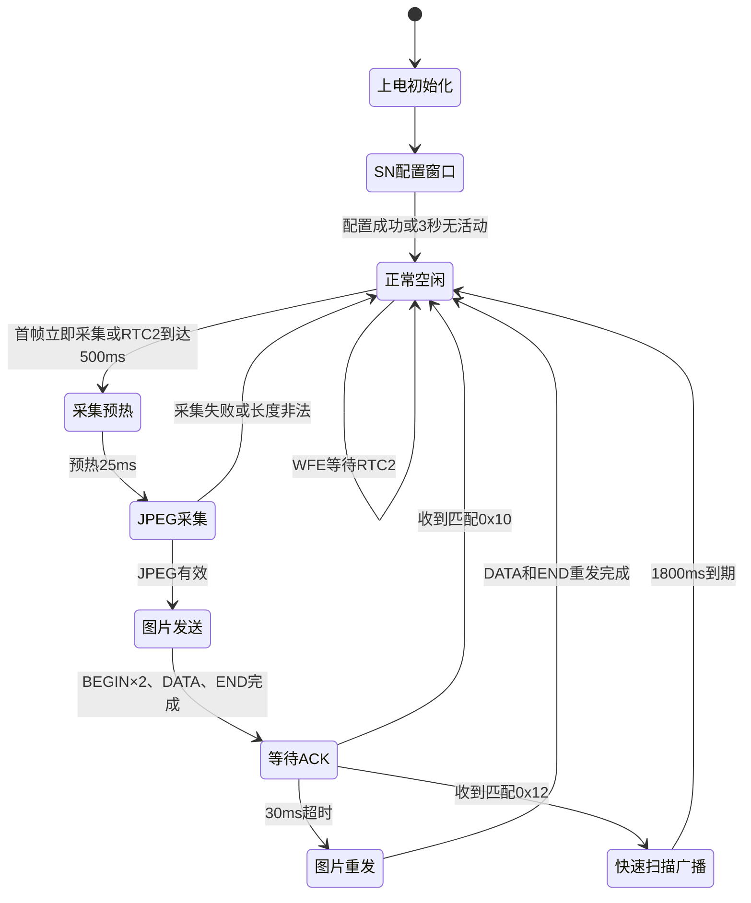

# TX 软件框架与完整运行流程

本文说明当前 `nrf_tx/examples/peripheral/radio/TX` 工程的整体行为，重点描述上电、SN配置、周期唤醒、图像采集、无线发送、ACK重发、天线扫描协商和低功耗之间的关系。协议字段的逐字节定义见 `01-通信协议.md`。

## 1. TX职责

TX运行在nRF52832上，主要完成：

1. 从Flash加载胶囊SN；没有有效用户SN时使用FICR DEVICEID。
2. 上电时开放一次出厂SN配置窗口。
3. 控制OV7676、CX93510、补光灯和ADXL362完成一帧采集。
4. 把JPEG拆成固定254字节Radio包发送给RX。
5. 在END后短暂接收图片ACK或快速扫描请求。
6. 空闲时关闭高频时钟和不需要的外设，由RTC2周期唤醒。

TX不选择12路接收天线。天线选择由RX完成；TX只在收到合法扫描请求后暂停图片并临时密集广播SN。

## 2. 关键参数

参数以当前 `TX/config.h`、`legacy_protocol.h` 和 `image.c` 为准。修改时间参数时，需要同时检查RX侧对应窗口是否仍能覆盖TX行为。

| 宏或常量 | 当前值 | 单位 | 设置位置 | 实际作用与修改注意事项 |
| --- | ---: | --- | --- | --- |
| `RADIO_FREQUENCY_MHZ` | 2400 | MHz | `config.h` | Radio中心频率；RX必须同步修改 |
| Radio速率 | 2 | Mbit/s | `image.c` Radio初始化 | TX和RX必须一致 |
| Radio发射功率 | +4 | dBm | `image.c` Radio初始化 | 图片、SN和控制响应的发射功率 |
| `RADIO_PACKET_SIZE` | 254 | 字节 | `config.h`→协议常量 | BEGIN、DATA、END及扫描包的固定Radio载荷长度；RX必须一致 |
| `RADIO_QUEUE_DEPTH` | 4 | 包 | `config.h` | TX接收控制包/ACK的环形队列深度 |
| `IMAGE_PERIOD_MS` | 500 | ms | `config.h` | RTC2同时产生图片采集和普通SN广播请求 |
| `SN_BROADCAST_PERIOD_MS` | 500 | ms | `config.h` | 当前仅用于启动日志；实际周期仍由`IMAGE_PERIOD_MS`决定，单独修改不会生效 |
| `IMAGE_CAPTURE_LIGHT_WARMUP_MS` | 25 | ms | `config.h` | 补光、OV7676和ADXL362启动后的非阻塞预热时间 |
| `IMAGE_CAPTURE_TIMEOUT_MS` | 1000 | ms | `config.h` | `cx93510_capture_one()`同步等待上限；必须小于看门狗容许时间 |
| CX93510帧RAM上电稳定等待 | 5 | ms | `cx93510.c`硬编码 | P0.11拉高使能帧RAM后，到第一次SPI自动识别事务前的等待时间；仅首次初始化执行 |
| CX93510首次SPI事务间隔 | 10 | us | `cx93510.c`硬编码 | 上电后第一笔SPI事务会被接口自动识别丢弃，等待10 us后再正式读取版本和接口类型 |
| OV7676硬件复位低电平时间 | 5 | ms | `ov7676.c`硬编码 | 首次初始化时将XSHUTDOWN拉低；普通休眠唤醒不执行 |
| OV7676硬件复位释放等待 | 5 | ms | `ov7676.c`硬编码 | XSHUTDOWN拉高后等待XVCLK和代理I2C可用；普通休眠唤醒不执行 |
| OV7676配置表写入间隔 | 200 | us/项 | `ov7676.c`硬编码 | 完整寄存器表每写一项后的固定间隔；表项自身还可附带额外毫秒延时；仅首次初始化执行 |
| OV7676完整初始化稳定等待 | 60 | ms | `ov7676.c`硬编码 | 完整寄存器表写完并启动视频流后，等待AE/AWB/ISP开始稳定再回读校验；仅首次初始化执行 |
| CX93510压缩器复位等待 | 最多约100 | ms | `cx93510.c`硬编码 | 每次采集前最多轮询100次，每次间隔1 ms，等待压缩器`INIT_DONE` |
| CX93510帧头提交等待 | 最多100 | ms | `cx93510.c`硬编码 | 采集前端完成后等待JPEG首个状态QWORD真正写入帧RAM；包含在单次采集流程内 |
| `IMAGE_FRAGMENT_GAP_MS` | 1 | ms | `config.h` | 相邻DATA分片的最小启动间隔 |
| `IMAGE_PASS_GAP_MS` | 20 | ms | `config.h` | 启用双遍发送时两遍DATA之间的间隔；当前双遍发送关闭 |
| `IMAGE_ACK_TIMEOUT_MS` | 30 | ms | `config.h` | 首轮END后保持Radio RX、等待`0x10`或`0x12`的窗口；RX必须在此窗口内完成请求 |
| `IMAGE_MAX_RETRIES` | 1 | 次 | `config.h` | ACK超时后重发一次完整DATA和END，不重发BEGIN，也不等待第二次ACK |
| `FAST_SCAN_DURATION_MS` | 1800 | ms | `config.h` | 接受RX的`0x12`后暂停图片、密集广播SN的总窗口；必须覆盖RX正式扫描总时长 |
| `FAST_SCAN_SN_PERIOD_MS` | 8 | ms | `config.h` | 快速扫描期间`0x05+SN`广播间隔 |
| 快速扫描同步阶段 | 120 | ms | `image.c`硬编码 | 前120 ms内每4次SN广播插入一次`0x11`；不是`config.h`宏 |
| `SN_CONFIG_WINDOW_MS` | 3000 | ms | `config.h` | 上电配置窗口的无合法命令静默超时；合法命令会重新计时 |
| `SN_CONFIG_LED_TOGGLE_MS` | 100 | ms | `config.h` | 配置窗口内LED翻转周期，完整闪烁周期约200 ms |
| `SN_BROADCAST_STARTUP_REPEAT` | 3 | 次 | `config.h` | 配置窗口结束后连续广播当前有效SN |
| `WATCHDOG_TIMEOUT_SECONDS` | 3 | s | `config.h` | 主循环最长失去喂狗时间；必须覆盖单次1000 ms采集及正常调度抖动 |
| `LEGACY_IMAGE_MAX_SIZE` | 19252 | 字节 | `legacy_protocol.h` | TX允许发送、RX/STM旧格式可容纳的JPEG上限 |
| `LEGACY_IMAGE_PACKET_HEADER_SIZE` | 12 | 字节 | `legacy_protocol.h` | DATA中的CMD、Frame ID、SN和分片号 |
| `IMAGE_PAYLOAD_SIZE` | 242 | 字节 | `config.h`→协议常量 | 单个DATA最多携带的有效JPEG字节数，即`254-12` |
| `IMAGE_REPEAT_SEND_ENABLED` | 0 | 开关 | `config.h` | 0表示DATA只发1遍；设为1后`IMAGE_BLOCK_PASSES=2` |

### 2.1 时间参数对应关系

| 时间链路 | TX参数 | 对端或约束参数 | 必须满足的关系 |
| --- | --- | --- | --- |
| 周期采集 | `IMAGE_PERIOD_MS=500 ms` | RX发现驻留`650 ms` | RX单路驻留应覆盖至少一次常态SN广播 |
| ACK/扫描请求 | `IMAGE_ACK_TIMEOUT_MS=30 ms` | RX捕获END后立即发送`0x12` | RX处理END、切TX和发请求必须落在30 ms内 |
| 快速扫描 | `FAST_SCAN_DURATION_MS=1800 ms` | RX扫描`12×32 ms×4=1536 ms` | TX窗口比RX正式扫描多264 ms，用于协商启动和调度余量 |
| 快速RSSI采样 | `FAST_SCAN_SN_PERIOD_MS=8 ms` | RX每路驻留32 ms | 每路理论上覆盖4个SN广播周期 |
| 采集与看门狗 | 采集超时1000 ms | 看门狗3000 ms | 最长同步采集不能逼近看门狗上限 |

除表中明确标成“硬编码”的120 ms外，其余业务时间优先在`config.h`修改。RX发送`0x12`后的150 ms保频时间已由`RF1662_SCAN_REQUEST_HOLD_MS`统一配置。改变TX时间后，应同步复核`04-RX软件框架.md`中的发现驻留、ACK请求和正式扫描参数。

### 2.2 总状态图



## 3. 两套时间资源

### 3.1 TIMER1：活动阶段1 ms时间基准

TIMER1配置为1 ms中断，`TIMER1_IRQHandler()`每次执行：

```c
++g_time_ms;
```

`g_time_ms`用于：

- 上电SN配置窗口超时；
- 25 ms摄像头预热；
- 1 ms图片分片节拍；
- 30 ms ACK超时；
- 1800 ms快速扫描窗口；
- 8 ms快速SN广播间隔。

TIMER1依赖高频时钟，只在有业务时运行。业务全部结束后，TX停止TIMER1并释放外部高频晶振。

### 3.2 RTC2：低功耗500 ms周期唤醒

RTC2使用32.768 kHz内部RC低频时钟，预分频为0。当前500 ms比较值为：

```text
32768 × 500 / 1000 = 16384 ticks
```

每次RTC2比较中断只设置两个请求标志：

```c
m_sn_broadcast_due = true;
g_capture_due = true;
```

中断中不操作摄像头，也不发送Radio包。主循环被唤醒后再处理这些请求。RTC2只负责周期调度，不保存年月日时间；系统日历时间由STM板上的SD2058提供。

当前普通SN和图片共用同一个RTC2比较事件，所以二者实际周期都由 `IMAGE_PERIOD_MS`决定。`SN_BROADCAST_PERIOD_MS`当前仅用于启动日志显示；若以后需要两个不同周期，必须增加独立比较通道或软件分频，不能只修改该宏。

## 4. 上电启动流程

```text
启动32 MHz外部高频晶振
  ↓
初始化日志（总开关关闭时为空操作）
  ↓
从Flash加载SN；无有效记录时使用FICR DEVICEID
  ↓
启动3秒硬件看门狗
  ↓
初始化补光灯/配置状态灯
  ↓
初始化CX93510和OV7676，随后让OV7676休眠
  ↓
关闭空闲的nRF侧SPIM0
  ↓
初始化ADXL362，空闲时保持standby
  ↓
配置2400 MHz、2 Mbit/s、254字节Radio
  ↓
启动TIMER1的1 ms活动时间基准
  ↓
进入上电SN配置窗口
```

### 4.1 CX93510首次初始化顺序

`camera_init()`必须先初始化CX93510，再初始化OV7676。原因是nRF52832并不直接访问OV7676的I2C；OV7676的寄存器读写要经过CX93510内部I2C主机代理。因此CX93510的SPI接口和代理I2C必须先可用。

首次上电调用 `cx93510_init()`，严格顺序如下：

```text
初始化nRF侧SPIM0
  ├─ CS先拉高
  ├─ SCK先拉低
  └─ 配置8 MHz、Mode 0、MSB优先并使能SPIM0
  ↓
P0.11拉高，启用并持续保留CX93510帧RAM
  ↓
等待5 ms
  ↓
发送第一笔SPI读事务
  └─ 该事务用于CX93510接口自动识别，返回值主动丢弃
  ↓
等待10 us
  ↓
正式读取CX93510版本和SLAVE_SEL
  ├─ SLAVE_SEL低两位必须为01，确认已选择SPI接口
  └─ 校验失败则初始化失败并进入错误处理
  ↓
配置CX93510内部I2C主机
  └─ OV7676地址0x78/0x79、16位寄存器地址、8位数据、约400 kHz
  ↓
配置CX93510图像输入
  └─ 480×480、YUY2顺序、同步极性、有限单帧模式
  ↓
配置JPEG编码器
  └─ 亮度/色度DCT表、关闭差分JPEG、置RELOAD_TABLES
  ↓
回读关键寄存器确认CX93510配置正确
```

这里的 `P0.11` 在后续空闲阶段仍保持高电平。代码中的 `cx93510_host_suspend()`只关闭nRF侧SPIM0，不关闭CX93510，也不切断帧RAM。

### 4.2 OV7676首次初始化顺序

`cx93510_init()`成功后才调用 `ov7676_init()`：

```text
配置OV7676 XSHUTDOWN引脚P0.06为输出
  ↓
XSHUTDOWN拉低，保持5 ms
  └─ 对OV7676执行硬件关闭/复位阶段
  ↓
XSHUTDOWN拉高，等待5 ms
  └─ 等待XVCLK和CX93510代理I2C可用
  ↓
经CX93510代理I2C读取芯片ID和修订号
  └─ ID必须为0x7676，否则初始化失败
  ↓
顺序写入完整480×480 YUV422生产寄存器表
  ├─ 每项写完固定等待200 us
  └─ 个别表项还会执行其自带的额外毫秒延时
  ↓
显式写YUV顺序为Y0/U/Y1/V
  ↓
写MODE_SELECT=1，启动连续视频输出
  ↓
等待60 ms，让AE/AWB/ISP开始稳定
  ↓
回读模式、IO、尺寸、格式、YUV顺序和极性等关键寄存器
  └─ 任一校验失败则初始化失败
```

OV7676完整初始化成功后，`camera_init()`立即调用 `ov7676_sleep()`，写 `MODE_SELECT=0`，让传感器进入软件休眠。随后 `application_init()`调用 `cx93510_host_suspend()`关闭nRF侧SPIM0。此时系统已经完成一次性配置，但还没有拍照。

### 4.3 首次初始化结束后的空闲状态

首次初始化结束后的实际状态是：

| 部件 | 空闲状态 | 是否保留配置/数据 |
| --- | --- | --- |
| OV7676 | `MODE_SELECT=0`软件休眠，XSHUTDOWN仍为高 | 保留完整寄存器配置 |
| CX93510 | 芯片和P0.11帧RAM保持工作条件 | 保留CX寄存器配置和帧RAM访问条件 |
| nRF SPIM0 | `TASKS_STOP`后关闭 | SPIM寄存器配置保留，再次使用时只重新使能 |
| HFXO/TIMER1 | 进入正式运行后由业务忙闲状态决定启停 | RTC2继续负责500 ms唤醒 |

因此文档中的“关闭CX93510主机SPI”不能理解为“CX93510掉电”。当前代码也没有在每次拍照前重新执行CX93510或OV7676完整初始化。

### 4.4 上电SN配置窗口

配置窗口只在上电阶段开放。TX持续接收 `0x40～0x46` ZAYS控制命令：

| 命令 | 处理 |
| --- | --- |
| `0x40` | 开始新配置并清除尚未确认的暂存SN |
| `0x42` | 返回本机8字节DEVICEID |
| `0x44` | 校验DEVICEID，匹配后把新SN暂存在RAM |
| `0x46` | 把暂存SN写入Flash、回读生效并返回`0x47` |

窗口在以下任一条件成立时结束：

- `0x46`确认写入成功；
- 连续3000 ms没有收到合法配置命令。

配置期间状态灯每100 ms翻转一次，主循环持续处理Radio、日志、看门狗和WFE等待。窗口关闭后，未确认的暂存SN会被丢弃。

### 4.5 进入正式运行

配置窗口结束后：

1. 关闭持续Radio RX。
2. 连续广播3次当前有效SN。
3. 初始化并启动RTC2。
4. 设置 `g_capture_due=true`，因此第一张图片立即采集，不需要先等待500 ms。
5. 进入永久业务主循环。

## 5. 正常主循环顺序

每轮主循环严格按照以下顺序执行：

```text
有任务且活动时钟已关闭 → 恢复HFXO和TIMER1
  ↓
处理Radio接收队列中的控制包、ACK或扫描请求
  ↓
检查ACK是否达到30 ms超时
  ↓
推进1800 ms快速扫描广播
  ↓
发送到期的普通SN广播
  ↓
推进图像采集状态
  ↓
发送最多一个DATA分片
  ↓
处理日志并喂看门狗
  ↓
无业务时停止TIMER1和HFXO
  ↓
WFE等待RTC2或Radio等中断唤醒
```

先处理Radio再检查ACK超时，可以让截止时间附近刚收到的ACK先被确认，避免不必要的重发。快速扫描服务位于图片采集之前，RX请求扫描后会优先暂停新图片。

## 6. 活动时钟保持条件

以下任一条件成立，TX就保持HFXO和TIMER1运行：

| 条件 | 含义 |
| --- | --- |
| `m_fast_scan_active` | 正在按RX请求密集广播SN |
| `m_sn_broadcast_due` | RTC2已产生普通SN广播请求 |
| `g_capture_due` | RTC2已产生图片采集请求 |
| `m_capture_prep_state != IDLE` | 摄像头、补光灯和加速度计正在预热 |
| `g_image_tx.active` | 当前图片仍有BEGIN、DATA或END需要发送 |
| `g_image_tx.awaiting_ack` | 首轮END已发送，正在等待ACK或扫描请求 |

这些条件全部为假时，TX停止活动时钟并执行 `__WFE()`。RTC2继续运行并负责下一次500 ms唤醒。

## 7. 一帧图片的采集流程

### 7.1 收到采集请求

RTC2每500 ms设置 `g_capture_due=true`。主循环处理时先清除该标志。如果上一帧仍在发送或等待ACK，本次请求直接跳过，不排队，避免覆盖CX93510帧缓冲。

快速扫描期间也会清除采集请求并返回，扫描中不会拍照。

### 7.2 启动预热

可以采集时，TX执行：

1. 恢复访问CX93510所需的nRF SPIM0。
2. 打开P0.08补光灯。
3. 启动ADXL362的100 Hz测量。
4. 唤醒OV7676连续视频输出。
5. 设置当前时间加25 ms为预热截止时间。
6. 将采集状态设为 `CAPTURE_PREP_WARMUP` 并立即返回主循环。

25 ms等待本身不阻塞，期间仍可处理Radio、日志和看门狗。

这里是“从软件休眠恢复采集”，不是“重新初始化摄像头”。严格调用顺序为：

```text
cx93510_host_resume()
  └─ 只重新使能已经配置好的nRF SPIM0
  ↓
打开P0.08补光灯
  ↓
启动ADXL362 100 Hz测量
  ↓
ov7676_wakeup()
  └─ 经CX93510代理I2C只写MODE_SELECT=1
  ↓
记录“当前时间+25 ms”为预热截止时间
  ↓
返回主循环，等待截止时间
```

这一阶段不会拉低XSHUTDOWN，不会重新读取OV7676 ID，不会重写完整寄存器表，也不会重新配置CX93510的输入格式和JPEG参数。

### 7.3 预热完成并采集

达到截止时间后：

1. 读取一次ADXL362的X/Y/Z原始值并立即让ADXL362待机。
2. 调用 `cx93510_capture_one()`采集JPEG，最长等待1000 ms。
3. JPEG进入CX93510帧RAM后立即关闭补光灯并让OV7676休眠。
4. 保持SPIM0可用，因为后续发送还要从CX93510帧RAM读取JPEG。

“非阻塞采集状态机”指25 ms预热采用分阶段处理；真正的 `cx93510_capture_one()`仍是同步等待，最长可能阻塞1000 ms。

每次调用 `cx93510_capture_one()`虽然不重做芯片初始化，但会执行本帧必需的采集准备：

1. 复位JPEG压缩器和帧缓冲写指针，并最多约等待100 ms确认压缩器初始化完成。
2. 设置采集帧数为1并启动有限单帧采集。
3. 最多等待 `IMAGE_CAPTURE_TIMEOUT_MS=1000 ms`，直到采集前端完成。
4. 前端完成后再最多等待100 ms，确认JPEG首个状态块已经提交到帧RAM。
5. 扫描帧RAM，找出JPEG配置块和图像块的位置与长度。

### 7.4 采集后的休眠与SPIM0关闭时机

采集完成后先关闭补光灯，再写 `MODE_SELECT=0`让OV7676回到软件休眠。CX93510主机SPI不能马上关闭，因为图片发送服务还要逐片读取CX93510帧RAM：

```text
JPEG采集完成
  ↓
关闭补光灯
  ↓
OV7676软件休眠（MODE_SELECT=0）
  ↓
SPIM0继续保持开启
  ↓
从CX93510帧RAM读取JPEG并发送BEGIN/DATA/END
  ↓
收到匹配ACK，或重发流程结束，或发生读取/长度错误
  ↓
cx93510_host_suspend()关闭nRF侧SPIM0
```

若唤醒失败、采集失败、空帧或图片超长，则没有后续图片读取需求，会立即关闭SPIM0。

### 7.5 首次初始化与低功耗唤醒的区别

| 比较项 | 首次上电初始化 | 低功耗后每次采集启动 |
| --- | --- | --- |
| CX93510主机接口 | 完整配置SPIM0引脚、8 MHz、Mode 0并执行接口自动识别 | 只重新使能已经配置好的SPIM0 |
| CX93510帧RAM | P0.11拉高后等待5 ms | P0.11一直保持高，不重新等待 |
| CX93510身份检查 | 读取版本和SLAVE_SEL并校验SPI接口 | 不重复检查 |
| CX93510图像/JPEG配置 | 写入并回读校验全部关键配置 | 不重写；采集时只复位压缩器、写指针并启动单帧 |
| OV7676硬件引脚 | XSHUTDOWN低5 ms、高后再等5 ms | XSHUTDOWN保持高，不做硬件复位 |
| OV7676身份检查 | 读取并校验ID `0x7676`和修订号 | 不重复读取 |
| OV7676寄存器 | 写完整生产表，每项至少间隔200 us | 只写 `MODE_SELECT=1`唤醒 |
| 稳定等待 | 完整配置后等待60 ms，再回读校验 | 补光和传感器唤醒后非阻塞等待25 ms |
| 采集结束 | 初始化结束时立即写 `MODE_SELECT=0`并关闭SPIM0 | 拍完立即写 `MODE_SELECT=0`；SPIM0等图片事务真正结束后再关闭 |

结论：两条路径差别很大。首次初始化负责“建立并验证整条图像链路”；低功耗唤醒负责“恢复已经配置好的链路并拍一帧”。只有设备重新上电、硬件复位，或后续代码真正切断CX93510/OV7676电源并导致寄存器丢失时，才需要重新执行完整初始化。

### 7.6 TYGD31旧框架的实际实现

旧工程参考源码位于 `TYGD31-2.4GHZ/TYGD_TX`。旧代码同样使用nRF的SPI主机访问CX93510，但低功耗方法与当前框架不同。

#### 7.6.1 旧框架首次初始化

旧 `capsule_init()`的图像链路顺序为：

```text
spi_master_init(SPI0)
  └─ SPI0在上电阶段初始化一次
  ↓
cx93510_init()
  ↓
cx93510_init_pin()
  ├─ 将旧板CX93510_PIN_PDRAM配置为输出
  ├─ 当前旧源码实际使用P0.18，注释中保留过P0.21
  └─ PDRAM拉低并等待10 ms
  ↓
cx93510_start()
  ├─ PDRAM拉高
  ├─ 等待5 ms
  └─ 读取SLAVE_SEL_CTRL，最多尝试10次，失败间隔1 ms
  ↓
启动失败？
  ├─ 是：连续执行两组spi_master_reset()+spi_master_init()
  │       喂狗后重新开始；累计10次失败则NVIC_SystemReset()
  └─ 否：继续
  ↓
sensor_init()
  ├─ OV7676 XSHUTDOWN使用P0.06
  ├─ 拉低5 ms，再拉高5 ms
  ├─ 顺序写完整传感器表
  ├─ 每项固定间隔200 us，部分表项另有1 ms延时
  └─ 全表结束后等待60 ms
  ↓
等待10 ms
  ↓
cx93510_close()
  └─ 将旧板PDRAM拉低
  ↓
再等待10 ms
```

旧初始化有两个值得注意的细节：

1. 旧 `sensor_init()`没有读取并校验OV7676芯片ID，也没有像当前框架一样系统回读关键输出寄存器。
2. 旧SPI0只在启动时初始化，正常空闲路径没有关闭SPI外设；`spi_master_reset()`和再次初始化仅用于CX93510启动失败后的恢复。

#### 7.6.2 旧框架每次拍照的启动顺序

旧 `image_read()`每次拍照都会执行：

```text
cx93510_start()
  ├─ PDRAM拉高
  ├─ 等待5 ms
  └─ 轮询SLAVE_SEL_CTRL，确认CX93510可访问
  ↓
cx93510_setup()
  ├─ 复位JPEG编码器
  ├─ 根据上帧大小重新设置JPEG亮度/色度压缩档
  ├─ 重写SI_CFG_1、单帧数、480×480窗口和采集起点
  ├─ 处理JPEG表重新加载控制
  ├─ 打开补光灯
  ├─ sensor_wakeup()：写OV7676寄存器0x0100=1
  ├─ 等待CX93510完成状态
  ├─ 固定等待(2-1)×25 ms=25 ms
  └─ 写SI_CFG_2=0x80启动采集
  ↓
循环调用cx93510_get_image()
  ├─ 无图时每次等待1 ms
  ├─ count达到180后超时
  └─ 图片超过旧FRAME_DATA_SIZE时退出并提高后续压缩率
```

这说明旧框架每次唤醒并不会重写OV7676完整生产寄存器表，但会重新启动CX93510的PDRAM，并在每一帧前重写一批CX93510采集/JPEG寄存器。相比之下，当前框架在首次初始化时固定CX93510输入/JPEG基础配置，每帧主要做压缩器复位和单帧触发。

#### 7.6.3 旧框架采集完成后的关闭顺序

旧代码在成功获得图片时执行：

```text
cx93510_get_image()确认有效帧
  ↓
sensor_sleep()
  └─ 写OV7676寄存器0x0100=0
  ↓
关闭补光灯
  ↓
通过SPI把整张JPEG复制到nRF全局image_buff[]
  ↓
返回image_read()
  ↓
cx93510_close()
  └─ PDRAM拉低
  ↓
后续Radio从nRF的image_buff[]发送图片
```

若等待180轮仍无图，或检测到图片超过旧缓冲上限，旧 `image_read()`也会关闭补光灯并让OV7676休眠；函数退出前仍统一调用 `cx93510_close()`拉低PDRAM。

因此旧框架能够在图片发送前拉低PDRAM，是因为JPEG已经整体复制到nRF RAM，后续无线发送不再访问CX93510。当前框架没有使用整幅 `image_buff[]`，而是发送每个DATA分片时直接从CX93510帧RAM读取对应区间，所以不能沿用旧框架“拍完立即拉低PDRAM”的顺序。

#### 7.6.4 旧框架的SPI和低功耗结论

| 项目 | TYGD31旧框架 | 当前框架 |
| --- | --- | --- |
| nRF SPI外设 | 上电调用一次 `spi_master_init(SPI0)`；正常空闲没有SPI disable | 空闲调用 `cx93510_host_suspend()`停止并禁用SPIM0，使用前只重新使能 |
| CX93510帧RAM控制 | 旧板P0.18在每次采集前拉高、采集及整图搬运后拉低 | 当前板P0.11始终保持高，避免代理I2C和帧RAM访问条件丢失 |
| JPEG保存位置 | 整张图片先复制到nRF `image_buff[]` | 不保存整幅副本，发送时从CX93510帧RAM逐片读取 |
| OV7676空闲方式 | 写 `0x0100=0`软件休眠 | 写 `MODE_SELECT(0x0100)=0`软件休眠 |
| 每帧启动 | PDRAM高→CX寄存器设置→开灯→OV唤醒→等待25 ms→采集 | SPIM0使能→开灯/加速度→OV唤醒→非阻塞等待25 ms→采集 |
| 每帧结束 | OV休眠→关灯→整图搬入nRF RAM→PDRAM低；SPI0仍开启 | OV休眠→关灯→保持PDRAM和SPIM0读取分片→图片事务结束后关闭SPIM0 |
| CPU等待 | 主循环使用 `__WFI()` | 主循环使用 `__WFE()`，并结合RTC2、HFXO和TIMER1按需启停 |

所以“旧框架也关闭了SPI”这个说法并不准确。旧框架关闭的是CX93510侧的 `PDRAM` 控制，nRF的SPI0外设没有按每帧关闭；当前框架新增的SPIM0 suspend/resume才是在nRF外设层面做的节电处理。

### 7.7 图片有效性检查

以下情况放弃本帧，不分配Frame ID，也不发送BEGIN：

- 采集失败；
- JPEG长度为0；
- JPEG长度超过19252字节。

合法图片的Frame ID按0～254循环。随后清零校验和和重发计数，计算DATA总片数，并设置图片发送状态为活动。

## 8. 图片无线发送流程

### 8.1 分包规则

```text
DATA分片数 = (JPEG长度 + 241) / 242
```

每次主循环调用发送服务时，最多推进一个DATA分片。首个DATA发送前会额外连续发送2个BEGIN，因此第一轮实际为：

```text
BEGIN → BEGIN → DATA[0]
```

后续每轮最多发送一个DATA。相邻DATA的允许发送时间间隔为1 ms。

### 8.2 BEGIN（0x01）

BEGIN携带：

- Frame ID；
- 8字节胶囊SN；
- JPEG总长度；
- DATA总片数；
- TX版本；
- 本帧加速度有效位及X/Y/Z原始值。

BEGIN连续发送2次，不逐包等待确认。完整字节布局见 `01-通信协议.md`。

### 8.3 DATA（0x80）

每个DATA包含12字节协议头和最多242字节JPEG。分片号从0开始，最后一片只包含剩余有效字节，固定254字节包的尾部补0。

TX从 `frame.jpeg_offset + block_sent` 读取CX93510帧RAM，并只把本片有效JPEG字节加入8位累加校验和。读取失败时立即终止该帧、关闭SPIM0且不发送END。

当前 `IMAGE_REPEAT_SEND_ENABLED=0`，所以全部DATA只发一遍。代码保留两遍发送分支，但启用前需要同步复核整图校验和处理和RX行为。

### 8.4 END（0x03）

全部DATA完成后发送END，内容包括Frame ID、SN和整张JPEG有效字节的8位累加和。

首轮END发送完成后，TX立即切换到Radio RX，并设置：

```text
awaiting_ack = true
ACK截止时间 = 当前时间 + 30 ms
```

## 9. ACK和重发

RX返回的普通ACK为 `0x10 + Frame ID + SN`。TX只有在以下条件全部满足时才接受：

1. 当前确实正在等待ACK；
2. Frame ID与当前图片一致；
3. 8字节SN与当前胶囊一致。

匹配成功后，TX关闭Radio RX、清除重发计数并关闭CX93510主机SPI，本帧结束。

30 ms内未收到匹配ACK时：

1. 关闭Radio RX。
2. 重发计数加1。
3. 分片号、已发送字节数和图片校验和清零。
4. 重发全部DATA和END，不重发BEGIN。
5. 当前最多重发1次。
6. 重发END后不再等待第二次ACK，直接关闭SPIM0并结束本帧。

因此当前最坏发送序列是：

```text
BEGIN × 2 → DATA[0...N-1] → END → 等待30 ms
→ DATA[0...N-1] → END → 结束
```

## 10. 快速天线扫描协商

TX只在首轮END后的30 ms接收窗口内接受RX的 `0x12`。请求必须同时匹配当前Frame ID和SN。合法 `0x12`同时结束当前图片ACK等待，不需要RX再发送 `0x10`。

接受请求后：

1. 进入1800 ms快速扫描状态。
2. 清除图片采集请求，扫描期间不拍照。
3. 每8 ms发送 `0x05 + 当前8字节SN`。
4. 前120 ms内，每4次SN广播前插入一次 `0x11 + 当前SN`，帮助RX确认扫描已开始。
5. 1800 ms到期后退出扫描，清除扫描期间积累的普通SN和图片请求。
6. 等待下一个RTC2周期恢复正常500 ms图片流程。

快速扫描和RX十二路驻留、RSSI统计、候选切换的完整说明见 `05-TX-RX天线信号强度配置.md`。

## 11. 低功耗状态

| 部件 | 拍摄/发送阶段 | 空闲阶段 |
| --- | --- | --- |
| CPU | 主循环推进状态机 | `__WFE()`等待事件 |
| HFXO | Radio和活动时序需要时运行 | 无业务时停止 |
| TIMER1 | 1 ms活动时间基准 | 无业务时停止 |
| RTC2 | 始终运行 | 始终运行，500 ms唤醒 |
| OV7676 | 预热和采集时唤醒 | 软件休眠 |
| 补光灯 | 预热和采集时点亮 | 关闭 |
| ADXL362 | 每帧开始临时100 Hz测量 | standby，SPIM1关闭 |
| CX93510 SPIM0 | 采集、读取JPEG、等待可能重发时保持 | ACK完成、重发结束或失败后关闭 |
| Radio RX | 配置窗口或首轮END后最多30 ms | 其余时间关闭 |

## 12. 关键失败处理

| 情况 | TX行为 |
| --- | --- |
| OV7676唤醒失败 | 关闭灯、加速度和SPI，放弃本周期 |
| JPEG采集失败或超时 | 关闭SPIM0，等待下一周期 |
| JPEG为空或超过19252字节 | 不发送任何图片包 |
| CX93510帧RAM读取失败 | 中止发送，不发END |
| ACK超时 | 完整重发一次DATA和END |
| 快速扫描请求ID或SN不匹配 | 忽略，不改变当前ACK状态 |
| 看门狗3秒未喂 | TX复位 |

## 13. 关键源文件

| 文件 | 作用 |
| --- | --- |
| `main.c` | 初始化、SN配置窗口、主循环、TIMER1和低功耗入口 |
| `image.c/.h` | Radio、采集状态、图片发送、ACK和快速扫描 |
| `config.h` | 周期、超时、Radio和功能开关 |
| `legacy_protocol.h` | 无线命令、包长、字段偏移和字节序 |
| `cx93510.c/.h` | JPEG采集和帧RAM读取 |
| `ov7676.c/.h` | 图像传感器初始化、唤醒和休眠 |
| `dev_adxl362.c/.h` | 三轴加速度初始化、测量、读取和待机 |
| `spi_bus.c/.h` | CX93510 SPI总线控制 |
| `capsule_sn_storage.c/.h` | SN Flash持久化和回读校验 |
| `tx_runtime_log.c/.h` | 可裁剪的运行日志 |
